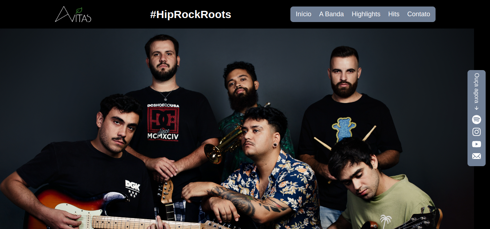

# Site Banda Avitas

<h1 align="center">
  
</h1>

> Projeto em desenvolvimento, com previsão de conclusão em 02/07/2023.
> Criação do site desde a concepção do layout/design, até o código front-end e envio de formulário de contato. 

### 🚧 Ajustes e melhorias

Próximas atualizações serão voltadas nas seguintes tarefas:

- [ ] Micro interações (Framer Motion);
- [ ] Inclusão de galeria de fotos da banda;


## 💻 Pré-requisitos

Antes de começar, verifique se você atendeu aos seguintes requisitos:
* Você tem uma máquina `<Windows / Linux / Mac>`.
* Você tem o [git](https://git-scm.com) instalado na sua máquina.
* Você tem o [node](https://nodejs.org/en/) instalado na sua máquina.

## 🚀 Para visualizar

bash:
```
# Clone este repositório
$ git clone <https://github.com/vitorrdc/siteAvitas>
# Acesse a pasta do projeto no terminal/cmd
$ cd siteAvitas
# Instale as dependências
$ npm install ou yarn install
# Acesse a pasta do projeto no terminal/cmd
$ cd siteAvitas
# Execute a aplicação em modo de desenvolvimento
$ npm run dev ou yarn dev
# O servidor inciará na porta:3000
# Agora é só acessar o endereço http://localhost:3000 no Browser de sua preferência
```

### 🛠 Tecnologias

As seguintes ferramentas foram usadas na construção do projeto:
- [NextJS](https://nextjs.org/)
- [JavaScript](https://developer.mozilla.org/pt-BR/docs/Web/JavaScript)
- [Chakra UI](https://chakra-ui.com/)
- [Email JS](https://www.emailjs.com/)

### 👨🏾‍💻 Autor
---

 

Feito com ❤️ por Vitor Ribeiro 👋🏽 Entre em contato!


[](mailto:vitor.camposrdc@gmail.com)
